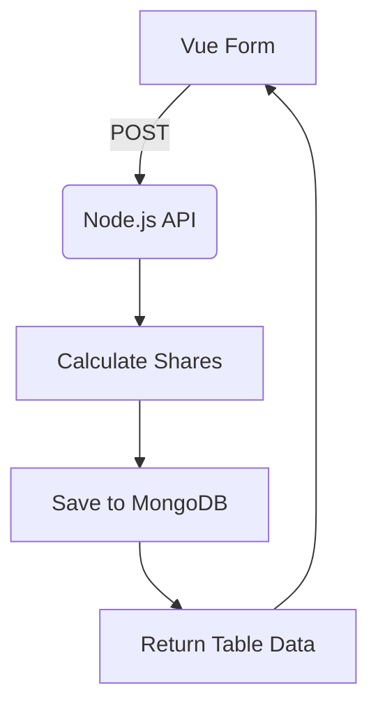

# Project Requirements Document: Group Payment Splitter

## 📌 Overview
**Project Name**: FairSplit  
**Tech Stack**: MEVN (MongoDB, Express.js, Vue.js, Node.js)  
**Purpose**: Automate fair cost-sharing for group purchases with proportional discount distribution and historical tracking.

---

## 🎯 Core Requirements

### 1. Calculation Engine (Node.js/Express)
- **Proportional Discount Distribution**:
  ```javascript
  // Formula Implementation Guide for Copilot
  function calculateShare(personAmount, subtotal, totalDiscount, deliveryFee, totalPeople) {
    const discountShare = (personAmount / subtotal) * totalDiscount;
    const deliveryShare = deliveryFee / totalPeople;
    return Math.round((personAmount - discountShare + deliveryShare) / 100) * 100;
  }
  ```
- **Proportional Discount Distribution**: Nearest Rp100 (e.g., Rp10,385 → Rp10,400)
- **Edge Cases**:
  - Handle zero discount (equal delivery fee split)
  - Negative totals validation

### 2. Frontend Components (Vue.js 3)
- **Input Form**:
  ```vue
  <template>
    <!-- Copilot: Generate dynamic form with these fields -->
    <input v-model="person.name" placeholder="Name">
    <input v-model.number="person.amount" type="number" placeholder="Rp">
    <button @click="addPerson">+ Add Person</button>
    <!-- Delivery/Discount inputs -->
  </template>
  ```
- **Output Table**:
  | Person | Order Amount | Discount Share | Final Owed |
  |--------|-------------:|---------------:|-----------:|
  | A      | Rp15,000     | Rp4,615        | Rp10,400   |

### 3. Database Schema (MongoDB)
  ```javascript
  // Copilot: Use this schema for all CRUD operations
  {
    _id: ObjectId,
    orders: [
      {
        name: String,
        amount: Number,
        discountShare: Number,
        finalOwed: Number,
        paid: Boolean // For partial payments
      }
    ],
    subtotal: Number,
    deliveryFee: Number,
    totalDiscount: Number,
    createdAt: { type: Date, default: Date.now }
  }
  ```

---

## 🔧 Technical Specifications

### API Endpoints
| Endpoint         | Method | Description                                              |
|------------------|--------|----------------------------------------------------------|
| /api/calculate   | POST   | Accepts JSON: { people: [{name, amount}], deliveryFee, discount } |
| /api/history     | GET    | Returns paginated results sorted by createdAt            |

### Data Flow


---

## 🚀 Milestones

### 1. Phase 1 (Core):
- Calculation engine + basic form
- ✅ Test Case: Verify Rp65,000 total → Rp45,000 after discount  

### 2. Phase 2 (History):
- MongoDB integration
- History view with sorting

### 3. Phase 3 (Polish):
- Partial payment tracking
- Export to CSV

---

## 🧪 Validation Rules
```javascript
// Copilot: Implement these validations
function validateInput(input) {
  return (
    input.people.length > 0 &&
    input.people.every(p => p.name && p.amount > 0) &&
    input.deliveryFee >= 0 &&
    input.discount <= (subtotal + deliveryFee)
  );
}
```